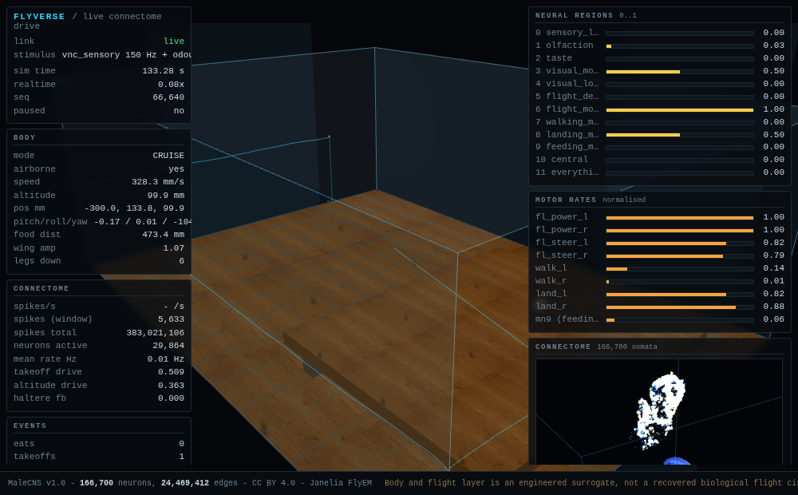

# FlyVerse

A native Rust simulation of the Janelia FlyEM **MaleCNS v1.0** connectome — 166,700
neurons, 24,469,412 signed synapses — driving an embodied fly around a virtual room,
streamed live to a browser over a small HTTP API.



## Read this first: what is real and what is not

This project sits on a real connectome and an engineered body. That boundary matters
more than any other property of the code, so it is stated up front rather than buried.

**Real, taken from the dataset and its own dynamics:**

- The connectome graph: 166,700 neurons, 24,469,412 signed edges (14,745,137
  excitatory, 9,724,275 inhibitory), compiled from the public FlyEM MaleCNS v1.0
  release (CC BY 4.0). Loaded whole. No pruning, no sampling, no synthetic neurons.
- Spike dynamics: leaky integrate-and-fire at `DT_MS = 0.1` ms, with spikes
  propagated over the true adjacency (`src/lif.rs`). A 60 s run emits ~172 million
  spikes.
- Motor and descending read-outs: wing power, wing steering, walking, landing, MN9
  (feeding), DNg02, DNg07 and SAPP are counted from actual spikes in named neuron
  groups. They are measured, never assigned.
- Neuron group annotations: the dataset's own `male_cns_v1_neural_io.json`.
- Wing aerodynamics: a quasi-steady blade-element cycle mean with the measured
  force coefficients, over a planform measured from the fly's own wing mesh.
  At full stroke one wing gives ~1.8x half the body weight, from the measurements
  alone with no tuning factor (`src/wing.rs`).
- Rotational damping from the flapping wings, derived from the same wing drag
  that resists rotation. Opposes rates; it cannot hold an attitude.
- Haltere afferents: the real campaniform/proprioceptive neurons, driven by the
  body's own angular velocity through the Coriolis deflection model. This is the
  one route by which the connectome can feel that the body is rotating.
- Liftoff: physical. The fly leaves the surface when its wings out-lift its
  weight, with no takeoff timer and no vertical impulse.

**Engineered surrogates, written by this project:**

- Ground locomotion: leg motor read-out sets a capped walking speed. No leg
  kinematics, no contact model.
- The takeoff, landing and feeding state machine, including the feeding timer and
  the landing label.
- The odour field (a stimulus field, not a fluid solve), the optic-flow proxy, and
  the looming-wall channel (`src/room.rs`, `src/sim.rs::sense`).
- The `vnc_sensory` stimulus: 6,370 body IDs replayed at a fixed 150 Hz from the
  dataset's own reference set. The brain's main input is **canned**, not generated by the
  simulated body.
- The entire room: geometry, table, food cube, collisions.

The public dataset contains no muscles, no ventral nerve cord and no donor body
state, so the embodiment cannot be recovered from it. What can be recovered is the
sensory side, and that is now wired in. See
[`docs/embodiment.md`](docs/embodiment.md) for what the de-surrogation changed,
which constants are measured, and what the fly does now, and
[Provenance](#provenance-real-versus-surrogate) for the per-layer table.

## What it currently does

Measured over a 60 s closed-loop run (`--seconds 60 --seed 7`, full model, 175.2M
spikes), with the haltere afferents connected. The `off` column is the same run
with `FLYVERSE_NO_HALTERE=1`, the control condition:

| Measure | halteres on | halteres off |
|---|---|---|
| Airborne time within 20 mm of a wall | 2.3 % | 5.6 % |
| Wall contacts | 8 | 36 |
| Altitude | mean 39.8 mm, p05 40.0, p95 41.9, max 58.2 | mean 36.6 mm, p05 0.4, p95 43.2, max 60.0 |
| Path vs net displacement | 19,649 mm vs 452 mm (tortuosity 43.5) | 25,786 mm vs 424 mm (tortuosity 60.8) |
| Mean speed | 328 mm/s | 426 mm/s |
| Mean \|yaw rate\| | 3.4 rad/s | 5.4 rad/s |
| Takeoffs / landings | 1075 / 1074 | 795 / 794 |
| Meals | 0 | 0 |

Liftoff is physical now: the wings beat, and the fly leaves the surface when the
aerodynamic force beats its weight. That happens within a few hundred ms, with no
takeoff timer and no vertical impulse.

What it does after that is best described as skittering rather than flying. The
room's table top is at 40 mm, and the fly spends most of its time at z = 41 mm on
top of it, touching down roughly every 50 ms, travelling at a few hundred mm/s and
turning at a few rad/s. It does not climb away, navigate, avoid walls, or reach
the food.

The `analyze` command tests **why**. The room reaches the brain through exactly one
wall-proximity channel (the loom signal), so the correlation between that signal and
the steering output is a direct measure of whether the brain is responding to walls:

```
corr(loom, steer differential) = -0.006
corr(loom, yaw rate)           =  0.198
|yaw rate| with a wall imminent 4.74 rad/s  vs 3.07 rad/s when clear
|steer|    with a wall imminent 0.090       vs 0.089     when clear
```

The loom channel is still driven **identically on both sides**
(`d_loom_l.rate_hz = d_loom_r.rate_hz = loom * 60.0`), so it carries no left/right
information; even a perfect response could not choose a direction. The steering
motor neurons show no measurable drive from it.

There is no avoidance reflex in the body layer either: the wall response is a
position clamp plus a 0.15 restitution bounce.

Caveat: this test is confounded by the behaviour itself, since the fly spends
almost all of its time with a wall already imminent, so the channel is largely
saturated. A clean test needs the fly released mid-room.

The haltere-on and haltere-off columns differ, and they differ in the direction a
working stabiliser would move them: fewer wall contacts, less turning, a steadier
altitude. **That difference is not evidence of anything.** The system is chaotic,
so two runs differing in any input diverge, and that divergence alone produces
differences of this size. The perturbation test that could have settled it has
now been run, and it came back negative:

> The body is given an angular velocity it did not generate, with both signs, and
> the steering motor response is averaged separately by sign. Across five
> haltere-connected runs the sign-conditioned steering signature is
> **+0.00044 (t = 0.05)**, flipping sign between seeds and not scaling with
> amplitude. The probe bounds any steering response to an imposed 25 rad/s yaw at
> about ±0.02, against a standing steering differential near −0.09.

So there is no support for a haltere-mediated stabilising reflex here, and there
is an upper bound on how large one could be. Full method, controls, and numbers in
[`docs/haltere-probe.md`](docs/haltere-probe.md); the accounting of what is real
and what is surrogate is in [`docs/embodiment.md`](docs/embodiment.md).

Reproduce it:

```bash
./target/release/flyverse haltere-probe --seed 7 --out runs/haltere-probe/s7
FLYVERSE_NO_FLOW=1 ./target/release/flyverse haltere-probe --seed 7 --out runs/haltere-probe/nf
scripts/probe_table.sh runs/haltere-probe/*.json
```

## Quick start

Requirements: Rust 1.85 or newer, and a connectome pack (not included, see
[Data](#data-and-attribution)).

```bash
./build.sh build --release          # wraps cargo so the Nix toolchain is on PATH

# the pack is looked up at ./official-pack, or $FLYVERSE_PACK, or --pack DIR
./target/release/flyverse census    # confirm the pack loaded

./target/release/flyverse serve --port 8099
# then open http://127.0.0.1:8099/  (keys: 1/2/3 change camera, space pauses, r resets)
```

Paths default to the working directory and can be overridden:

| Variable | Default | Purpose |
|---|---|---|
| `FLYVERSE_PACK` | `official-pack` | connectome pack directory |
| `FLYVERSE_VNC_TARGETS` | `data/targets_vnc_sensory.u64` | reference stimulus set |
| `FLYVERSE_IO_JSON` | `assets/male_cns_v1_neural_io.json` | neuron group annotations |
| `FLYVERSE_NO_HALTERE` | unset | `1` computes the haltere model but never delivers its spikes |
| `FLYVERSE_NO_FLOW` | unset | `1` silences the optic-flow proxy channel |

## Commands

| Command | Purpose |
|---|---|
| `serve` | live simulation + browser view + HTTP/SSE API |
| `analyze` | headless behaviour run: `trace.csv`, `summary.json`, `report.html` |
| `haltere-probe` | imposed-rotation perturbation test of the haltere channel |
| `probe` | quick headless sanity read-out of the closed loop |
| `bench` | engine throughput benchmark (steps/s, realtime factor, phase breakdown) |
| `census` | dump pack contents and dataset manifest |
| `verify` | deterministic step-by-step spike log with a FNV-1a hash, for regression |

### Behaviour analysis

```bash
./target/release/flyverse analyze --seconds 30 --seed 7 --out runs/seed7
scripts/behavior.sh run 30 7 11 23    # sweep several seeds
scripts/behavior.sh table             # one row per run
scripts/behavior.sh show runs/seed7   # headline block
```

Each run writes:

- `trace.csv` — every sampled control window: position, speed, yaw rate, all nine
  motor read-outs, all five descending read-outs, every sensory drive, cumulative
  events.
- `summary.json` — mode occupancy, events, movement, altitude, wall proximity,
  turning, the loom-response test, motor/descending/sensory means, floor-occupancy
  grids.
- `report.html` — self-contained interactive report: floor-occupancy heatmap,
  altitude histogram, mode timeline, altitude/speed traces, loom-versus-steering
  traces, and the provenance table. No network access, no dependencies.

Note: a 60 s run takes roughly 10 minutes of wall clock while the live server is
competing for the same cores. Use `--seconds 30` for a quick look.

## HTTP API

| Endpoint | Description |
|---|---|
| `GET /` | the browser client (`web/`) |
| `GET /api/health` | pack size, spike total, paused flag |
| `GET /api/stream` | SSE, one JSON frame per control window (~2 ms) |
| `GET /api/brain/positions` | soma positions, `f32` little-endian xyz triples |
| `GET /api/spikes?from=N` | incremental spike indices since a sequence number |

## Architecture

```
src/lif.rs       LIF dynamics, dense vote + ring spike propagation (rayon)
src/pack.rs      memory-mapped CSR connectome pack loader
src/groups.rs    neuron group annotations, Poisson stimulus drivers
src/sim.rs       closed loop: window loop, sensory injection, motor decoding, HTTP/SSE
src/body.rs      the embodied fly: rigid-body dynamics, walking and feeding surrogates
src/wing.rs      wing aerodynamics, rotational damping, haltere afferent model
src/room.rs      room geometry, collision, odour field
src/analyze.rs   headless behaviour analysis and reporting
src/httpd.rs     static files + SSE
web/app.js       three.js client: body rig, room, 166,700-neuron cloud
```

Neurons step every 0.1 ms; the body is integrated once per 20 steps (a 2 ms control
window). The browser receives one frame per control window.

## Performance

Engine benchmark, 10,000 steps, 8 threads (`flyverse bench`):

| | |
|---|---|
| Steps per second | 2,287 |
| Realtime factor | 0.229 × |
| Spikes in 1.0 s of sim time | 1,678,764 |
| Active neurons | 17,929 |

Time is split roughly 40 % refractory/dense update, 38 % spike propagation,
15 % ring clear and stimulus, 1 % fire scan.

The dominant limit is LIF integration over 166,700 neurons per 0.1 ms step. The
simulation currently runs **slower than biological real time**. In the closed loop
the analysis harness measured 2,472 steps/s and 0.247 × real time on a 60 s run
(`FLYVERSE_NO_HALTERE` unset, 175.2M spikes); the figure moves with host load,
since earlier runs on a busier machine measured 0.10 ×. Closing the gap is future
work, not a current property.

## Provenance: real versus surrogate

| Layer | Status | Detail |
|---|---|---|
| Connectome graph | real | FlyEM MaleCNS v1.0, 166,700 neurons / 24,469,412 signed edges, CC BY 4.0 |
| Neuron dynamics | real | LIF at 0.1 ms over the true adjacency (`src/lif.rs`) |
| Motor / descending read-outs | real, measured | counted from spikes in named groups |
| Group annotations | real | `assets/male_cns_v1_neural_io.json` |
| Soma positions in the 3D view | real, partial | 139,662 of 166,700 placed; 27,038 have no soma in the source |
| `vnc_sensory` stimulus | replayed | 6,370 IDs at fixed Poisson 150 Hz, not body-generated |
| Odour field | surrogate | finite-core exponential plume, `room.rs::odor` |
| Optic flow | surrogate | `0.5 * speed/300 + 0.5 * turn`, no rendered scene |
| Loom | surrogate, bilateral | time-to-contact with the nearest wall face, same value both sides |
| Wingbeat | surrogate | visual phase 19 Hz against a real ~200 Hz stroke |
| Aerodynamics | real, measured | quasi-steady blade-element mean over the fly's own measured wing planform (`src/wing.rs`) |
| Rotational damping | real, derived | wing drag resisting body rotation; opposes rate, holds no setpoint |
| Haltere afferents | real, wired | the dataset's own haltere neurons, driven by the body's angular velocity via Coriolis deflection |
| Muscle (`Motors`) | transduction | motor-neuron rate to stroke amplitude and stroke-plane tilt; the dataset contains no muscle |
| Liftoff | real, physical | wing force exceeds body weight, no timer and no impulse |
| Altitude / attitude / heading | **absent** | no setpoint, no stabiliser, no bank or turn command |
| Ground locomotion | surrogate | capped walking speed from the leg motor read-out |
| Takeoff / landing / feeding timing | surrogate | state labels and a feeding timer |
| Collision | surrogate | position clamp, 0.15 restitution, no avoidance |

## Limitations

- The fly does not navigate or feed. It skitters just above the table top at a
  near-constant height (see [above](#what-it-currently-does)).
- The flight is not emergent in the strong sense. Nothing tells the fly to hold
  altitude or to be stable, but "it stays up" is a weaker claim than "the
  connectome knows how to fly", and only the weaker claim is supported.
- The haltere afferents are wired and driven, but the perturbation probe finds
  **no measurable stabilising response** in the wing motor neurons. See
  [`docs/haltere-probe.md`](docs/haltere-probe.md). The probe's sensitivity bounds
  any such response at about ±0.02 of the steer differential; a smaller reflex is
  not excluded, only unmeasured.
- `WING_DZ`, the wing root's height above the centre of mass, is an estimate at
  0.20 mm and it sets the pitching moment; the pitch behaviour is sensitive to it.
- Wing inertia is not modelled, so the large instantaneous reaction torques within
  a stroke are absent.
- The loom channel is bilateral, so wall proximity is delivered without direction.
- `vnc_sensory` replay means the brain's main input is independent of the body.
- Slower than real time (0.23 × on 8 threads).
- 27,038 neurons have no soma position and are absent from the 3D cloud.
- The browser client needs a working WebGL path. On CPU-only or software-rendered
  hosts it will be slow.

## Data and attribution

The connectome pack is **not** in this repository (142 MB, and derivable). It is
compiled from the public FlyEM MaleCNS v1.0 release:

```
gs://flyem-male-cns/v1.0/connectome-data/flat-connectome/
```

`official-pack/manifest.json` records the dataset, license, transmitter sign policy,
counts and the SHA-256 of every source and derived array, so a pack can be
reproduced and checked byte-for-byte.

Source table hashes recorded in that manifest:

| File | SHA-256 |
|---|---|
| `annotations.feather` | `2177e246113e4cfbf1e7772ec37c6da1955ff22e8063d0b1f833101f99a9a3b2` |
| `official-neurotransmitters.feather` | `95c9289220663abeb3409f3ad9e5a7f8a53f8093f5139d15502cd08da8879621` |
| `official-connectivity.feather` | `e35da783d1c686b2b58b3b87cd6a403ae43bfcfba8bff28e08ef752c1a56afc1` |

Sign convention: acetylcholine positive; GABA and glutamate negative.

See [THIRD_PARTY_NOTICES.md](THIRD_PARTY_NOTICES.md) for the full attribution and
license inventory of bundled assets.

## License

MIT for the original code in this repository — see [LICENSE](LICENSE). The MIT
license does **not** cover bundled third-party data or assets, which retain their own
terms (CC BY 4.0 for MaleCNS data, Apache-2.0 for the NeuroMechFly body meshes, MIT
for three.js).
